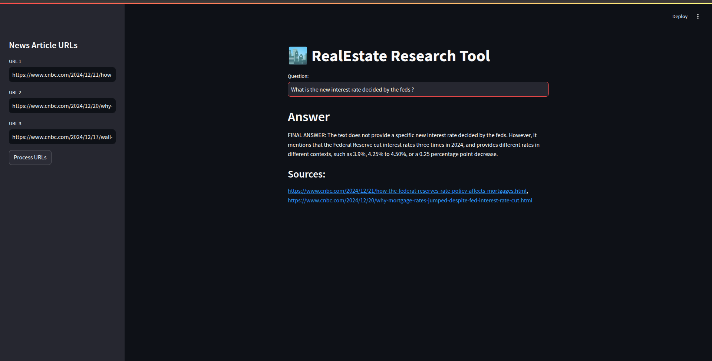

# 🏙️ Real Estate Research Tool

A RAG-based research assistant for real estate news. Paste in article URLs, ask
questions in plain English, and get answers back with the source articles cited.

Built on LangChain with ChromaDB for retrieval and GPT-OSS 120B via Groq for
generation. The domain is real estate, but nothing in the pipeline is
domain-specific, so it works on any set of article URLs.



## How it works

```
URLs → requests + unstructured partition_html → RecursiveCharacterTextSplitter (1000 char chunks)
     → HuggingFace all-MiniLM-L6-v2 embeddings → ChromaDB (persisted)
     → LCEL retrieval chain + GPT-OSS 120B → answer + sources
```

A few details worth calling out:

- **Built for langchain 1.x.** The original course code used
  `RetrievalQAWithSourcesChain` and `load_qa_with_sources_chain`, both removed in
  langchain 1.0 along with the `langchain.chains` and `langchain.prompts`
  modules. Retrieval and answering are wired with LCEL instead, so this runs on
  current langchain rather than needing a pinned old release.
- **Sources come from document metadata**, not from parsing the model's text
  output, so citations reflect the chunks actually retrieved.
- **A custom QA prompt** (`prompt.py`) frames the model as a real estate
  research assistant and defines how each source document is formatted.
- **Token budgeting** caps the retrieved context at roughly 32k characters, so
  long articles do not blow the context window.
- **The vector store persists** to `resources/vectorstore/`, and is reset on
  each new batch of URLs so answers never mix runs.

## Setup

```bash
pip install -r requirements.txt
```

Create a `.env` file in the project root:

```
GROQ_API_KEY=your_groq_api_key_here
GROQ_MODEL=openai/gpt-oss-120b
```

Get a free key at [console.groq.com](https://console.groq.com). `GROQ_MODEL` is
optional and falls back to `openai/gpt-oss-120b`.

## Run

```bash
streamlit run app/main.py
```

The app opens in your browser. Enter up to three article URLs in the sidebar,
click **Process URLs**, wait for the pipeline to finish, then ask a question.

The first run downloads the embedding model (about 90MB), so give it a moment.

Example articles to try:

- https://www.cnbc.com/2024/12/21/how-the-federal-reserves-rate-policy-affects-mortgages.html
- https://www.cnbc.com/2024/12/20/why-mortgage-rates-jumped-despite-fed-interest-rate-cut.html

Then ask something like *"What was the 30 year fixed mortgage rate, and on what date?"*

## Layout

Three folders, one per job:

```
.
├── ingestion/              scrape urls, split into chunks, embed into Chroma
│   └── pipeline.py
├── retrieval/              answer questions against the index, with sources
│   ├── prompts.py
│   └── qa.py
├── app/                    Streamlit UI
│   └── main.py
├── notebooks/              LangChain building blocks, worked through separately
│   ├── 1_document_loader.ipynb
│   ├── 2_text_splitter.ipynb
│   └── generate_patient_records.py
├── resources/              screenshot, and the persisted vector store at runtime
├── config.py               shared settings, LLM and vector store singletons
├── requirements.txt
└── .env.example
```

`config.py` sits outside the three because both ingestion and retrieval need the
same LLM and vector store instances, and building them twice would mean loading
the embedding model twice.

The notebooks cover the two pieces the pipeline is built on, document loading
and text splitting, in isolation. `notebooks/generate_patient_records.py`
regenerates the 600-record sample dataset they use; it is seeded, so the output
is reproducible.
